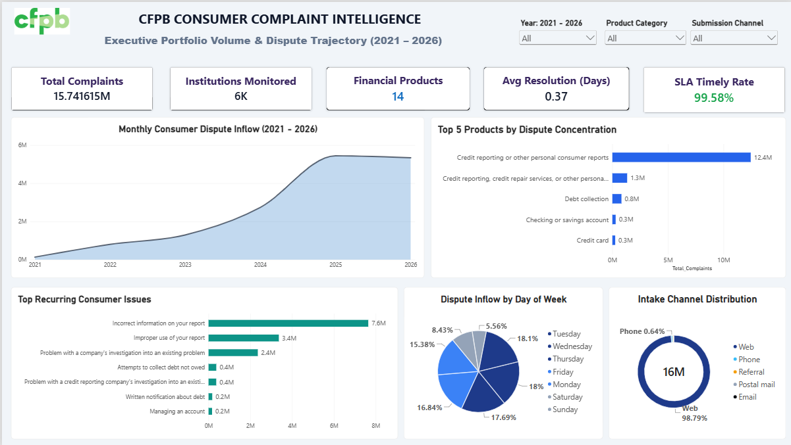
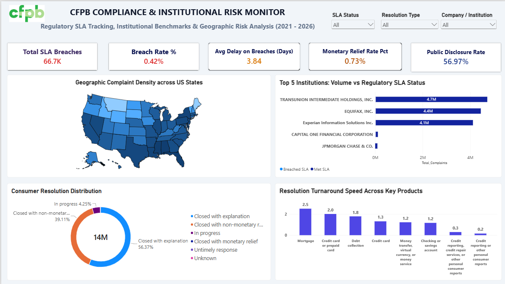

# Consumer Complaint Intelligence System
### Enterprise Data Pipeline, SQL Analytics & Institutional Risk Dashboard

## Datasets

**- Source:** This dataset was originally collected from the [Consumer Financial Protection Bureau (CFPB) Public Data Inventory](https://www.consumerfinance.gov/data-research/consumer-complaints/).

This project uses a very large dataset including the following versions:

- Raw dataset: [Google Drive Link](https://drive.google.com/file/d/1dDbTN3wWXKNYITXrxdXPQoJkIjrJx_8t/view?usp=sharing)
- Filtered dataset: [Google Drive Link](https://drive.google.com/file/d/1JRW9DtClHi57wuSDeYBNWZ3OEfCnELCM/view?usp=sharing)
- Cleaned dataset: [Google Drive Link](https://drive.google.com/file/d/1BOY-eSkOA8oBTURla6vXgpV5EHoMRxLP/view?usp=sharing)


## 📌 Executive Summary
An end-to-end analytics pipeline and business intelligence system built on **15.74 million** Consumer Financial Protection Bureau (CFPB) complaint records (2021-2026). The project evaluates financial institution accountability, regulatory Service Level Agreement (SLA) turnaround compliance, and dispute concentration across products and US jurisdictions.

---

## 🖥️ Executive Dashboards

### Page 1: Executive Portfolio & Volume Trajectory
*Focus: Inflow momentum, product dispute concentration, intake channels, and core consumer friction points.*



### Page 2: Institutional Compliance & SLA Risk Monitor
*Focus: Regulatory turnaround performance, SLA breach rates, geographic risk distribution, and resolution outcomes.*



---

## 📈 Key Business & Regulatory Insights

1. **Credit Bureau Oligopoly & Systemic Dispute Concentration:**
   * Over **78% of all 15.7M complaints** originate from a single product vertical: *Credit reporting or other personal consumer reports*.
   * Three credit bureaus (**TransUnion, Equifax, and Experian**) account for over **13.2 million combined disputes**.
   * The single largest driver is `"Incorrect information on your report"` (7.6M complaints), indicating systemic data verification and dispute automation challenges under FCRA guidelines.

2. **The "Explanation vs. Restitution" Resolution Gap:**
   * While institutions maintain an aggregate **99.58% Timely Response SLA compliance rate**, compliance does not imply consumer relief.
   * Over **56.3%** of disputes are closed strictly with an *Explanation*, and **39.1%** with *Non-monetary relief*.
   * Direct **Monetary Relief represents only 0.73%** of total institutional resolutions, highlighting that timely acknowledgment is frequently operationalized via automated templates rather than financial settlement.

3. **Geographic Risk & Enforcement Exposure:**
   * Dispute volume heavily concentrates in four high-population states: **California, Texas, Florida, and New York**.
   * These corridors represent critical exposure for state-level attorney general investigations and private class-action litigation under state-level consumer protection acts (e.g., CCPA).

4. **Digital Channel Dominance:**
   * **98.79%** of consumer intake arrives via web submissions, driving institutional turnaround times down to an average of **0.37 days** across automated pipelines.

---

## 🏗️ Technical Architecture & Pipeline

```text
[Raw CFPB API / CSV (~15.7M Records)]
                  │
                  ▼
[Colab / Python: Chunked Extraction & Type Casting]
                  │
                  ▼
[Cleaned Compressed Storage (Parquet Format, ~80% size reduction)]
                  │
                  ▼
[DuckDB Analytics Engine: Schemas, DDL, CTEs, Window Functions (DENSE_RANK, LAG)]
                  │
                  ▼
[Power BI Desktop: Star-Schema Semantic Model, DAX Measures, Cross-filtering]

```
## Tech Stack

- Storage & Processing: Python (pandas, matplotlib, pyarrow, fastparquet), Google Colab, Parquet.

- SQL Engine: DuckDB (In-memory columnar execution, analytical window functions, CTEs).

- Business Intelligence: Power BI (DAX, Power Query, Shape Maps, Interactive Cross-Filtering).
